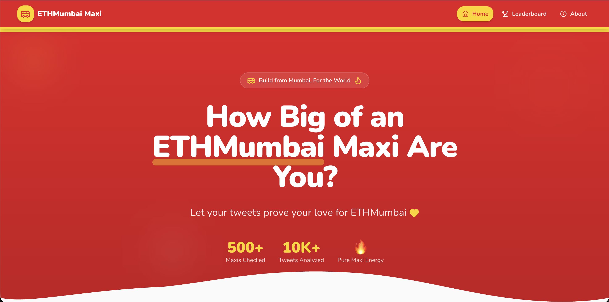

# 🚍 ETHMumbai Maxi Checker ❤️‍🔥

## Project info

**WEBSITE LINK :**: [https://ethmumbai-maxi-checker.lovable.app]

> How big of an ETHMumbai fan are you?  
> Let your X activity decide.

**ETHMumbai Maxi Checker** is a community-driven web app that measures how strongly someone resonates with the **ETHMumbai ecosystem**, based on their engagement on X (Twitter).

🛠️ **Built as part of an official ETHMumbai community challenge**, aimed at celebrating builders and community participation.

Inspired by Mumbai’s iconic **BEST bus culture** — bold, accessible, and builder-first.

---

## ✨ Features

- 🔍 Analyze ETHMumbai-related engagement
- 🧮 Calculate a **Maxi Score**
- 🏆 Assign fun, meaningful **rank tiers**
- 📊 Leaderboard (actively improving)
- 🖼️ Generate a **shareable score card image**
- 🐦 Share results directly on X

---

## 🏆 Ranking Tiers

| Score Range | Rank |
|------------|------|
| 0–5 | 🚌 Curious Commuter |
| 6–15 | 🎫 ETHMumbai Rider |
| 16–40 | 🚍 BEST Bus Regular |
| 41–80 | 🏙️ ETHMumbai Local |
| 81–150 | 🔥 ETHMumbai Maxi |
| 150+ | ❤️‍🔥 ETHMumbai OG |

---

## 🖼️ Demo & Screenshots


> Add screenshots of the working website below

```md


